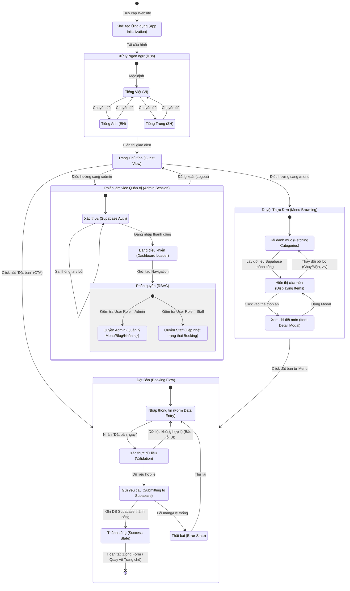

# Sơ đồ Luồng trạng thái (State Machine) - Cấp độ Ứng dụng

> Sơ đồ này thể hiện các trạng thái chính và luồng chuyển đổi trạng thái của các thành phần cốt lõi trong hệ thống HanaVeg.

## Giải thích Luồng Trạng Thái & Quản lý State (Zustand/React Context)

### 1. `useUIStore` (Global UI State)

- Quản lý trạng thái mở/đóng của `ItemDetail` Modal trong MenuFlow.
- Quản lý trạng thái thông báo toast (Thành công/Thất bại) trong BookingFlow.
- Thiết lập trạng thái Loading chung toàn cục (khi Fetch dữ liệu lớn).

### 2. `useLanguageStore` hoặc thư viện i18n

- Giữ state của `Language` (VI/EN/ZH) đang được active.
- Trigger việc re-render lại các components khi ngôn ngữ thay đổi.

### 3. `useAuthStore` (Supabase Auth Context)

- Giữ thông tin `user` và `role` hiện tại ở `AdminSession`.
- Bảo vệ (Protect) các routes `/admin/*`. Nếu state là `unauthenticated`, tự động chuyển hướng về trang Login.

### 4. Component Local State

- `FormData` trong form đặt bàn sử dụng `useState` hoặc `react-hook-form` để kiểm soát các field input liên tục mà không cần đưa lên Global state, tối ưu hóa re-render.
